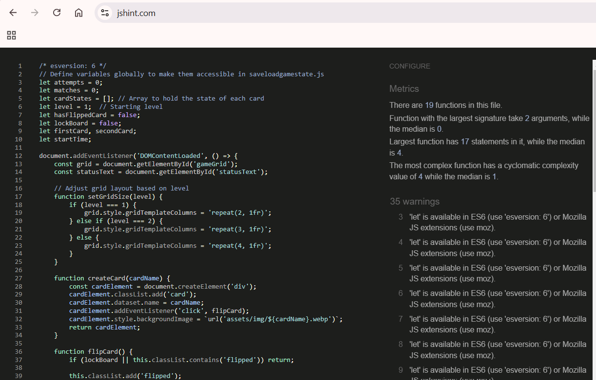
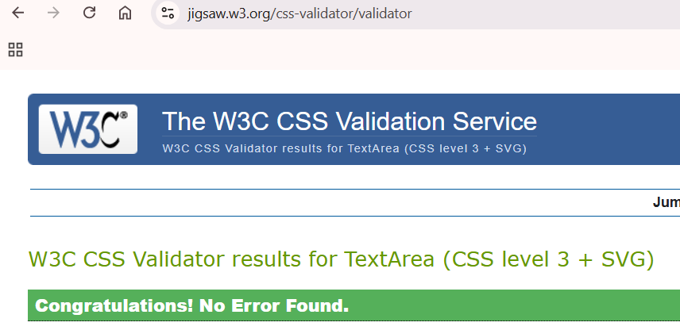
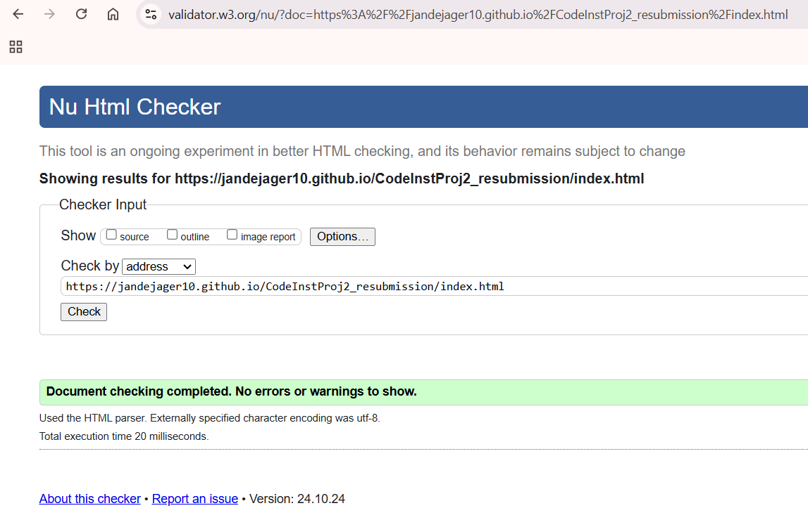

### Test Cases

1.  **Game Functionality**
    
    - **Card Flip**: Test that each card flips upon click and reveals the image. &#x2611;
    - **Matching Mechanism**: Ensure that a pair of matching cards stays flipped while unmatched pairs revert to their hidden state. &#x2611;
    - **Game Reset**: Verify that clicking the reset button resets the game grid, shuffles cards, and updates the status to zero attempts and matches. &#x2611;
    - **Victory Condition**: Test that all pairs being matched triggers a message or visual indicator that the game is complete. &#x2611;
2.  **UI and UX**
    
    - **Instructions Pop-up**: Check that the instructions button displays an alert with instructions for gameplay. &#x2611;
    - **Responsive Design**: Verify the grid layout, buttons, and text scale appropriately on different screen sizes, especially on mobile. &#x2611;
    - **Navigation**: Ensure the "Home" and "Contact" links function correctly and that both pages are styled consistently. &#x2611;
3. **Shuffling**

    - Test that the cards are shuffled randomly since I added more cards. &#x2611;
    - const deck = [...pairs, ...pairs].sort(() => Math.random() - 0.5).map(createCard); "https://stackoverflow.com/questions/64370139/codewars-permutations-kata-sort-method-that-returns-0-5-math-random"
4. **Footer Positioning**: 

    - In contact.html, the footer is set to position: fixed;, which causes it to overlap with content if the page height is less than the viewport height. Anything else does some weird things to the layout. &#x2612;
5. **Game State Saving and Loading**

    - Test that the game state is saved and loaded correctly. &#x2611;
    - In loadGameState, if the game state fails to load, I call resetGameState(), which clears the local storage. This ensures that it will erase any saved game state and restart from level 1. &#x2611;
6. **Accessibility**

    - I added aria-labels to all the buttons and links. &#x2611;
    - Not done for the images. &#x2612;
7. **Responsiveness**

    - Test that the game is responsive to different screen sizes. &#x2611;
    - Tested for mobile and desktop. &#x2611;
    - Tested for scale on multiple screen sizes. &#x2611;
8. **Browser Compatibility**

    - Tested for Edge, Chrome, and Firefox. &#x2611;
9. [JS Hint](https://jshint.com/) validation

    - No errors or warnings.

JavaScript file `script.js` was validated using [JSHint v2.13](https://jshint.com/).  

<em>Figure: JavaScript Validation Result</em>
No errors highlighted. 

10. CSS validated using [W3C Jigsaw Validation Service](https://jigsaw.w3.org/css-validator/#validate_by_input).  
   

<em>Figure: CSS Validation Result<em>
No errors highlighted.

 

11. The [Lighthouse](https://developer.chrome.com/docs/lighthouse/overview/) tool in Google Chrome was used to test site performance, accessibility and best practice.

12. The HTML code was validated using the [W3C Markup Validation Service](https://validator.w3.org/). Passed with no errors.

<em>Figure: HTML Validation Result</em>
No errors highlighted. 

    